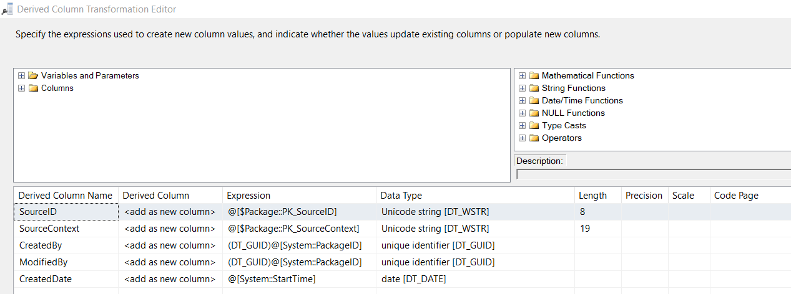

## Approach I. Event Handler - Log Packages Execution & and Packages Metadata
In SSMS SQL server, Create the log tables [[log].[Tl_Exec]](https://github.com/berserkhmdvhb/DWH_MSBI/blob/main/Projects/CustomerData/source/Queries/TableCreation_LOG_Tl_Exec.sql) and [[log].[Tl_Packages]](https://github.com/berserkhmdvhb/DWH_MSBI/blob/main/Projects/CustomerData/source/Queries/TableCreation_LOG_Tl_Packages.sql).


In all SSIS packages, add an `Execute SQL task` in Event Handler, set it to OLE DB connection, and use the following script:
```sql
-- Ensure the package exists in Tl_Packages
IF NOT EXISTS (
    SELECT 1
    FROM [log].[Tl_Packages]
    WHERE PackageName = ?
)
BEGIN
    INSERT INTO [log].[Tl_Packages] (
        [PackageId],
        [PackageName],
        [CreatedDate],
        [IsActive]
    )
    VALUES (
        ?, -- System::PackageID
        ?, -- System::PackageName
        CAST(? AS DATETIME),
        1  -- Active
    );
END;

-- Log the package execution in Tl_Exec
IF NOT EXISTS (
    SELECT 1
    FROM [log].[Tl_Exec]
    WHERE PackageId = (
        SELECT PackageId
        FROM [log].[Tl_Packages]
        WHERE PackageName = ?
    )
    AND RunTime = ?
)
BEGIN
    INSERT INTO [log].[Tl_Exec] (
        [PackageId],
        [RunTime]
    )
    SELECT PackageId,
           CAST(? AS DATETIME)
    FROM [log].[Tl_Packages]
    WHERE PackageName = ?;
END;
```
Then, map to corresponding variables:


---
## Approach II. Add Metadata Columns to Tables
This methods is designed to know how each row is created/updated, and trace the packageID responsible for it.
And thanks to Approach I, one can readily find package metadata (name, etc) in log table [[log].[Tl_Packages]](https://github.com/berserkhmdvhb/DWH_MSBI/blob/main/Projects/CustomerData/source/Queries/TableCreation_LOG_Tl_Packages.sql)

To all tables, add the following metadata columns in table creation script of SQL

```sql
[SourceID] NVARCHAR(255) NULL,
[CreatedBy] UNIQUEIDENTIFIER NULL,
[ModifiedBy] UNIQUEIDENTIFIER NULL,
[CreatedDate] DATETIME DEFAULT GETDATE()
```

In SSIS, add a `Derived Column Transfer` component as following:

| Derived Column Name | Expression |
|------------|------------|
|SourceID|`@[$Package::PK_SourceID]`|
|CreatedBy|`(DT_GUID) @[System::PackageID]`|
|ModifiedBy|`(DT_GUID) @[System::PackageID]`|
|CreatedDate|`@[System::StartTime]`|



