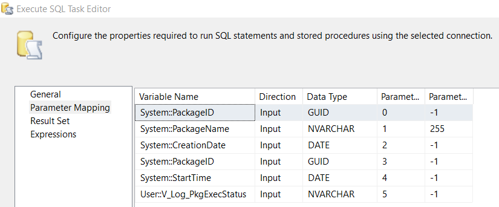

Add an `Execute SQL task` in Event Handler, set it to OLE DB connection, and use the following script:
```sql
-- Ensure the package exists in Tl_Packages
IF NOT EXISTS (
    SELECT 1
    FROM [log].[Tl_Packages]
    WHERE PackageName = ?
)
BEGIN
    INSERT INTO [log].[Tl_Packages] (
        [PackageId],
        [PackageName],
        [CreatedDate],
        [IsActive]
    )
    VALUES (
        ?, -- System::PackageID
        ?, -- System::PackageName
        CAST(? AS DATETIME),
        1  -- Active
    );
END;

-- Log the package execution in Tl_Exec
IF NOT EXISTS (
    SELECT 1
    FROM [log].[Tl_Exec]
    WHERE PackageId = (
        SELECT PackageId
        FROM [log].[Tl_Packages]
        WHERE PackageName = ?
    )
    AND RunTime = ?
)
BEGIN
    INSERT INTO [log].[Tl_Exec] (
        [PackageId],
        [RunTime]
    )
    SELECT PackageId,
           CAST(? AS DATETIME)
    FROM [log].[Tl_Packages]
    WHERE PackageName = ?;
END;
```
Then, map to corresponding variables:



