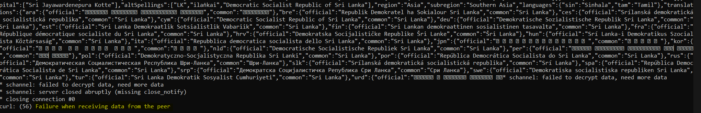

# Source 1: RestCountries
Source: `https://restcountries.com/v3.1/all`

To test if link is working:
`curl -v https://restcountries.com/v3.1/all`

The result fails with following meesage:

# Source 2: World Bank Country API:
This source provides country data, including ISO 3166-1 alpha-2 and alpha-3 codes.

`curl -k -v https://api.worldbank.org/v2/country?format=json`

